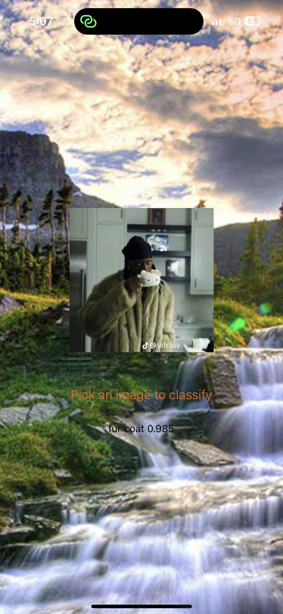

# Object indentification sample react-native project

## How to start this project

Run following command first in Terminal

```
yarn install
```

And then run following to star npx to text

```
npx expo start
```

## Some sample pages are 

    1. First image with 98.5% confindence prediction



 


